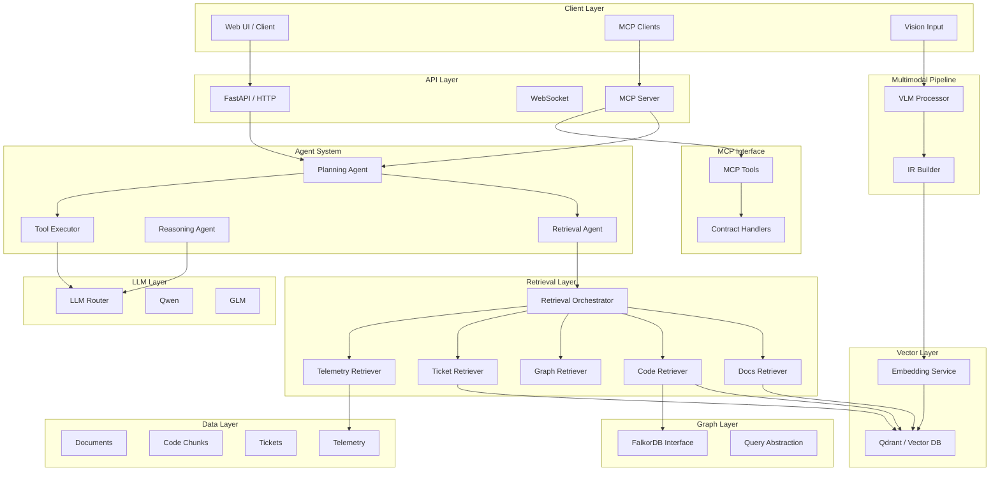
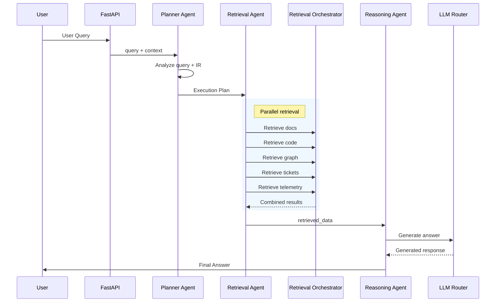
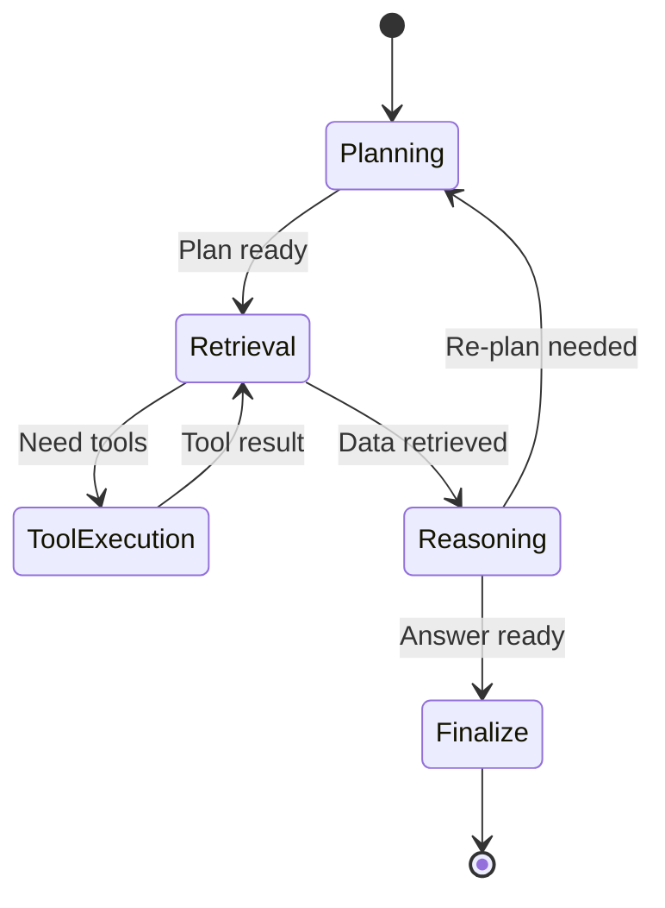
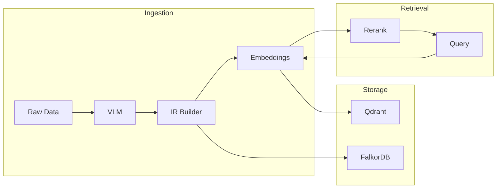
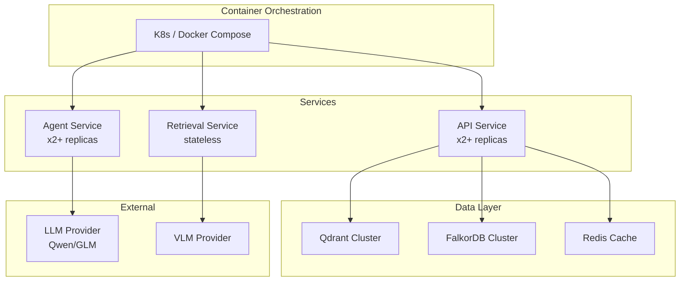

# SAP BTP Engineering Intelligence System - Architecture Design

## 1. High-Level Architecture Diagram



## 2. Core Components

### 2.1 API Layer

| Component | Responsibility | Interface |
|-----------|--------------|-----------|
| FastAPI Server | HTTP endpoints, request/response handling | POST /query, GET /health, MCP endpoints |
| WebSocket | Real-time streaming | /ws stream |
| MCP Server | MCP protocol compliance | JSON-RPC 2.0 |

### 2.2 Agent System

| Agent | Input | Output | Description |
|-------|-------|--------|-------------|
| Planning Agent | User query + IR | Execution plan with steps + tools | Decomposes query into retrieval/execution plan |
| Retrieval Agent | Plan | Retrieved data from multiple sources | Executes retrieval plan against all sources |
| Reasoning Agent | IR + retrieved data + tools | Final answer | Synthesizes answer from retrieved context |
| Tool Executor | Tool calls | Tool results | Executes specific tools |

### 2.3 Retrieval Layer

| Retriever | Data Source | Search Type |
|----------|------------|------------|
| Docs Retriever | Qdrant | Semantic (embeddings) |
| Code Retriever | Qdrant + FalkorDB | Semantic + graph relationships |
| Graph Retriever | FalkorDB | Cypher queries |
| Ticket Retriever | Ticket DB | Keyword + semantic |
| Telemetry Retriever | Logs/Metrics | Filtering + semantic |

### 2.3.1 Entity Graph Cache
- LRU cache (capacity: 500, TTL: 1 hour)
- Populated on cache miss from FalkorDB via graph retriever
- Integrated into EnhancedHybridRetriever and EntitySearchTool
- Exposed via REST: GET /entity/cache/stats, POST /entity/cache/invalidate

### 2.3.2 Lazy Retriever Initialization
HybridRetriever uses @property-based lazy initialization for all retrievers.
Only the retrievers needed for the classified strategy are instantiated, reducing startup time and memory.

### 2.4 Graph Layer

| Component | Technology | Purpose |
|-----------|------------|---------|
| FalkorDB Interface | FalkorDB | Graph operations |
| Query Abstraction | Cypher | Simplified query API |

### 2.5 Multimodal Pipeline

| Stage | Input | Output |
|-------|-------|-------|
| VLM Processor | Images/Diagrams | Extracted text/metadata |
| IR Builder | Multimodal outputs | Normalized IR (deduplicated, validated) |

### 2.6 MCP Interface

| Component | Function |
|-----------|----------|
| Tool Definitions | JSON schema for all tools |
| Request Router | Routes MCP requests to appropriate handlers |
| Contract Validators | Request/response schema validation |

## 3. Data Flow



## 4. Agent Interaction Flow



## 5. Knowledge Flow



## 6. Deployment Architecture



### 6.1 Docker Compose Topology

```yaml
# docker-compose.yml overview
services:
  api:
    image: engineering-intelligence-api
    ports:
      - "8000:8000"
    environment:
      - QDRANT_HOST=qdrant
      - FALKORDB_HOST=falkordb
      - LLM_ROUTER_URL=llm-router
  
  agent:
    image: engineering-intelligence-agent
    environment:
      - LLM_ROUTER_URL=llm-router
  
  qdrant:
    image: qdrant/qdrant
    ports:
      - "6333:6333"
  
  falkordb:
    image: falkordb/falkordb
    ports:
      - "6379:6379"
```

## 7. System Constraints Compliance

| Requirement | Implementation |
|-------------|----------------|
| Multi-RAG | 5 retrieval sources (docs, code, graph, tickets, telemetry) |
| Multimodal Input | VLM pipeline + image processing |
| MCP Integration | MCP server + tool definitions + JSON-RPC 2.0 |

## 8. Module Organization

```
engineering_intelligence/
├── api/                    # API layer (FastAPI)
│   ├── main.py            # Application entry
│   ├── routes.py          # HTTP routes
│   ├── mcp.py             # MCP server
│   └── schemas.py         # Request/response models
├── agents/                 # Agent system
│   ├── planner.py         # Planning agent
│   ├── retrieval.py       # Retrieval agent  
│   ├── reasoning.py       # Reasoning agent
│   ├── executor.py        # Tool executor
│   └── orchestration.py   # Orchestration engine
├── retrieval/             # Retrieval layer
│   ├── orchestrator.py    # Retrieval orchestrator
│   ├── docs.py           # Docs retriever
│   ├── code.py           # Code retriever
│   ├── graph.py          # Graph retriever
│   ├── ticket.py         # Ticket retriever
│   └── telemetry.py      # Telemetry retriever
├── graph/                 # Graph layer
│   ├── client.py         # FalkorDB client
│   └── queries.py       # Query abstractions
├── multimodal/           # Multimodal pipeline
│   ├── vlm.py           # VLM processor
│   └── ir_builder.py    # IR builder
├── llm/                  # LLM layer
│   └── router.py        # LLM router client
├── tools/                 # Tool system
│   ├── base.py          # Tool interface
│   ├── architecture.py # Architecture evaluator
│   ├── security.py     # Security validator
│   └── cost.py         # Cost estimator
├── models/               # Data models
│   ├── ir.py           # IR schema
│   ├── graph.py        # Graph schema
│   ├── retrieval.py    # Retrieval schemas
│   └── mcp.py         # MCP contracts
├── evaluation/         # Evaluation framework
│   └── test_cases.py   # Test cases + scoring
└── docker-compose.yml   # Deployment config
```

---

**Document Version**: 2.4  
**Status**: Architecture Design Complete  
**Next Phase**: Core Data Models (PHASE 3)